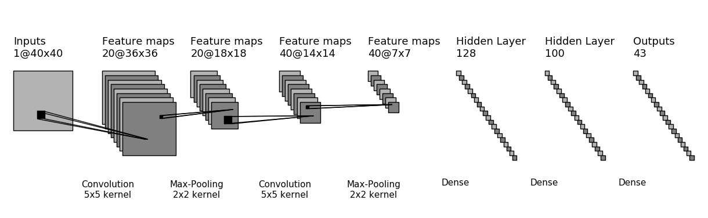
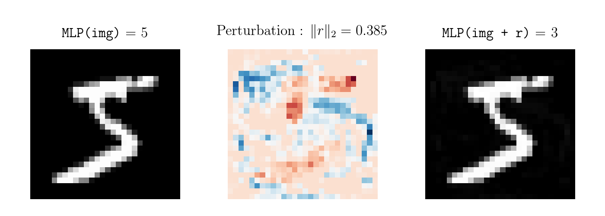

# Building, attacking and improving classifiers for MNIST

The aim of this school project is to show the vulnerabilities of classifier networks to adversarial examples and to explore different protection techniques.


## Getting Started

### 1. Creating the MNIST dataset

The MNIST dataset is automatically downloaded and divided into three parts : `train.pt`, containing 50.000 samples, and `test.pt` and `val.pt` containing 10.000 samples each.

*Note: Originally, when loading the MNIST dataset, PyTorch divides it between `train.pt` and `test.pt`, but using a third file `val.pt` allows to test a model's generalisation without overfitting the hyperparemeters on the validation dataset.*

### 2. Network training

The networks are defined in `architectures.py`. For the moment, the following networks are available : a MLP, a CNN, and their dropout versions (MLP_d and CNN_d). Other networks will be added in the future.



*The CNN model.*

Note that the training parameters (`lr`, `epochs` and `batch_size`) and functions (`loss_fn` and `optimizer`) are included in the class definition of the model: it makes switching between models easier and makes it possible to use a universal training script : `train.py`.

**For example, to train the CNN model with dropout, you just need to run:**

```bash
python train.py CNN True
```

The second parameter specifies wether the model will be saved (in `models/` if it is the case).

#### Networks accuracies:

|  Network |  MLP   | MLP_d  |  CNN   | CNN_d  |
|---------:|:------:|:------:|:------:|:------:|
|      acc | 98.79% | 97.88% | 99.64% | 99.35% |
| test_acc | 97.23% | 97.24% | 98.95% | 99.10% |

*(These results obviously are far from being state of the art, and will be improved in the future)*

## 3. Network attacks

### Description of the attack method

Attacking a network is somewhat similar to training one: it consists in a gradient descent on a 28x28 Variable `r` so that `model.forward(image + r)` gives a wrong prediction. More formally, we are looking for a perturbation `r` such that:

<a href="https://www.codecogs.com/eqnedit.php?latex=\dpi{120}&space;\small&space;\begin{cases}&space;\Vert&space;r&space;\Vert_p&space;=&space;div\\&space;Img&space;&plus;&space;r&space;\in&space;[0,&space;1]\\&space;Pred(img&plus;r)&space;\neq&space;Pred(Img)\\&space;\end{cases}" target="_blank"></a>

A network attack takes in parameters the id `img_id` of the image to attack, the euclidian norm `p` used to determine the norm of the perturbation `r`, the norm value `div` of the perturbation, and the learning rate `lr` of the gradient descent.


**To attack a previously trained and saved model, load the `attack.py` file:**

```bash
python -i attack.py CNN_d
```

Multiple functions are then available.

- The `attack()` function runs the attack described above. When the attack fails (no wrong prediction after 1000 steps), the function returns `(False, image, r, image_adv)`, otherwise it returns `(True, image, r, adv)`.

```Python
attack(img_id, lr=0.005, div=0.2, p=2)
```

- The `minimal_attack()` function searches the minimal value `div` between `a` and `b` (using a dichotomy) such that the perturbation still fools the model, then output and saves (in `docs/images/attack_results/`) a graph that displays the original image, the perturbation and the modified image.

```Python
minimal_attack(img_id, p=2, a=0, b=4, lr=0.005)
```



*A minimal adversarial example for the MLP network*

---


## Project requirements

- Python 3
- PyTorch
- numpy
- matplotlib
- texlive, ghostscript and dvipng (for a fancy matplotlib latex-style prining)
- tqdm

## TODO

- [ ] Experiment with other network architectures (AlexNet, Inception...)
- [ ] Experiment with CapsNets

## Suggestions

Feel free to message me any comments or suggestions ! I'd love to hear some critics or feedback on this project.