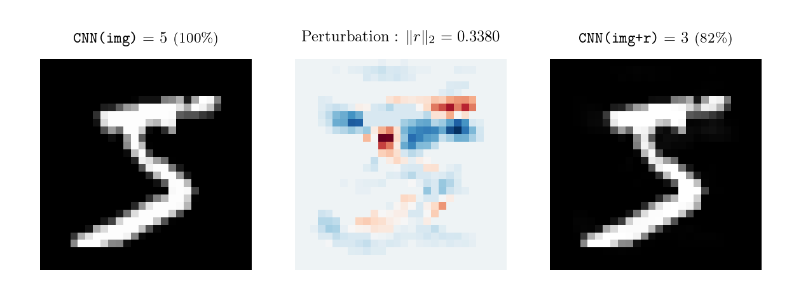
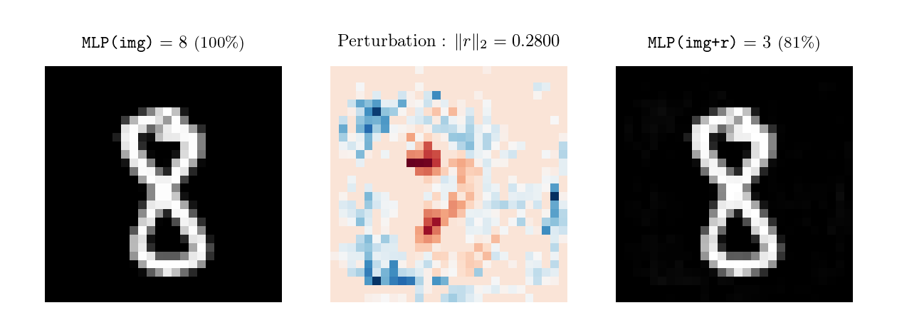

# Building, attacking and improving classifiers for MNIST

$$\sum \int \vert \:: \vert = \int \sum$$

The aim of this school project is to show the vulnerabilities of classifier networks to adversarial examples and to explore different protection techniques.



## Getting Started

### 1. Creating the MNIST dataset

The MNIST dataset is automatically downloaded and divided into three parts : `train.pt`, containing 50.000 samples, and `test.pt` and `val.pt` containing 10.000 samples each.

*Note: Originally, when loading the MNIST dataset, PyTorch divides it between `train.pt` and `test.pt`, but using a third file `val.pt` allows to test a model's generalisation without overfitting the hyperparemeters on the validation dataset.*

### 2. Network training

The networks are defined in `architectures.py`. For the moment, the following networks are available : a `MLP` and a `CNN`, their Dropout versions (`MLP_d` and `CNN_d`), and their BatchNorm versions (`MLP_bn` and `CNN_bn`). Other networks will be added in the future.

Note that the training parameters (`lr`, `epochs` and `batch_size`) and functions (`loss_fn` and `optimizer`) are included in the class definition of the model: it makes switching between models easier and makes it possible to use a universal training script : `train.py`.

**For example, to train the CNN model with dropout, you just need to run:**

```sh
python train.py CNN_d True
```

The second parameter specifies wether the model will be saved (in `models/` if it is the case).

#### Networks accuracies:

| Network |   acc    | test_acc | val_acc  |
|:--------|----------|----------|----------|
| MLP     |  98.70%  |  97.05%  |  96.92%  |
| MLP_d   |  95.76%  |  96.15%  |  95.58%  |
| MLP_bn  |  99.54%  |  97.99%  |  97.77%  |
| CNN     |  99.62%  |  98.95%  |  99.05%  |
| CNN_d   |  99.00%  |  98.78%  |  98.99%  |
| CNN_bn  |  99.93%  |  99.22%  |  99.20%  |

## 3. Network attacks

### Finding a minimal perturbation

Let's call `Prediction` and `Confidence` the functions that respectively gives the digit prediction of the network and the confidence prediction of the network on the real label of the image. To trick a network, we want to determine a sloghtly modified version of the image , `adv_image`, such that `Prediction(adv_image)` is no longer equal to `Prediction(image)`. This is usually done by using `Confidence` as a loss function: The smaller it gets, the less the networks thinks that the modified image still holds its initial digit.

Attacking a network is consists in determining a perturbation $r$ such that `model.forward(image + r)` gives a wrong prediction. We want to find a minimal perturbation for a given Euclidian norm.

Two ways to do this are implemented:

### A. Dichotomy attack

First, the function `attack_fixed_norm()` implements an algorithm that, given an image from the dataset, computes an acceptable value of $r$, by a gradient descent on the pixels of the perturbation. The loss function is the confidence of the classifier on the real label of the image.

More formally: given a norm value $N$, we want to find $r$ such that:

$$
\begin{cases}
  \Vert r \Vert_p = N \\
  Img + r \in [0, 1] \\
  \texttt{Prediction(img+r)} \neq \texttt{Prediction(Img)} \\ \end{cases}
$$

Then, a dichotomy is performed for $N$ in $[0, 4]$, to determine the minimal accepted value that still tricks the network.

This method experimentally gives the best results, but is painfully slower than the second one.

### B. Automatic minimal attack

Instead of minimizing $\Vert r \Vert$ step by step, we create a custom loss function such that:

$$
\begin{cases}
  loss = \texttt{Conf(img+r)} & \text{if } \texttt{Conf(img+r)} \leq 0.4 \\
  loss = \texttt{Conf(img+r)} + \Vert r \Vert_p & \text{if } \texttt{Conf(img+r)} \leq 0.2 \\
  loss = \Vert r \Vert_p & \text{if } \texttt{Conf(img+r)} \leq 0.1 
\end{cases}
$$

### Instructions

**To attack a previously trained and saved model, load the `attack.py` file:**

```sh
python -i attack.py MLP
```

Multiple functions are then available.

- The `attack()` function runs the attack described in A. When the attack fails (no wrong prediction after 1000 steps), the function returns `(False, image, r, image_adv)`, otherwise it returns `(True, image, r, adv)`.

```Python
attack(img_id, lr=0.005, div=0.2, p=2)
```

- The `minimal_attack_dichotomy()` function searches the minimal value $div$ between $a$ and $b$ (using a dichotomy) such that the perturbation still fools the model, then outputs and saves (in `docs/images/attack_results/`) a graph that displays the original image, the perturbation and the modified image.

```Python
minimal_attack(img_id, p=2, a=0, b=4, lr=0.005)
```

- The `minimal_attack()` function runs the attack described in B.

```Python
minimal_attack(img_id, p=2, a=0, b=4, lr=0.005)
```



*A minimal adversarial example for the MLP network*

---


## Project requirements

- Python 3
- PyTorch
- numpy
- matplotlib
- texlive, ghostscript and dvipng (for a fancy matplotlib latex-style prining)
- tqdm

## TODO

- [ ] Experiment with other network architectures (AlexNet, Inception...)
- [ ] Experiment with CapsNets

## Suggestions

Feel free to message me any comments or suggestions ! I'd love to hear some critics or feedback on this project.