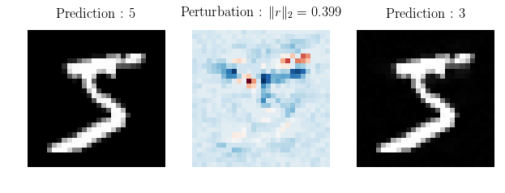
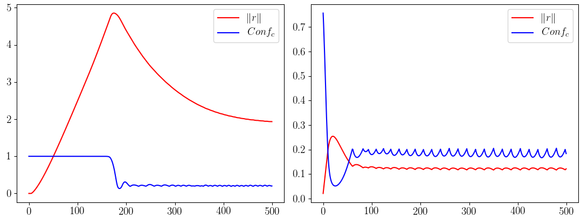
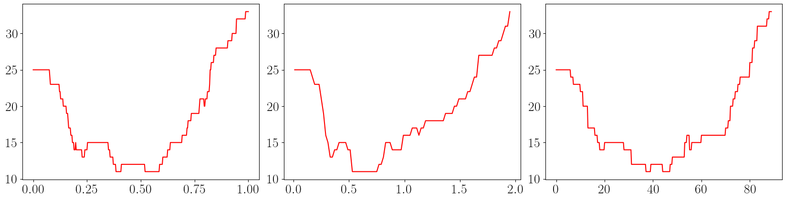
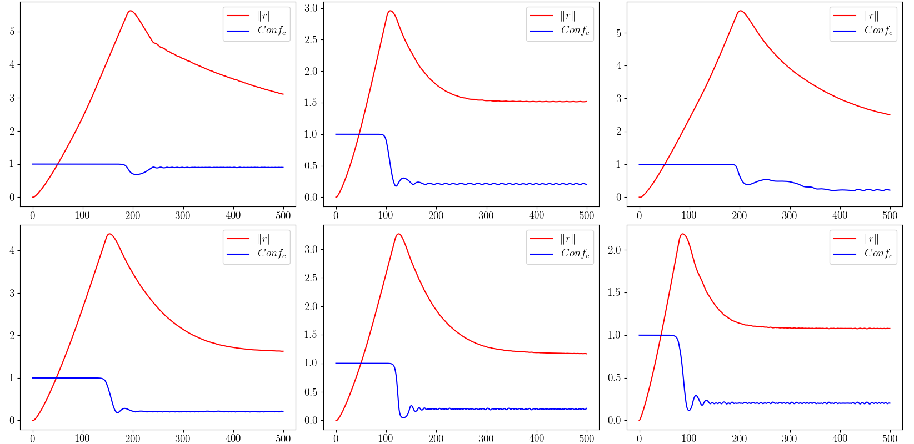
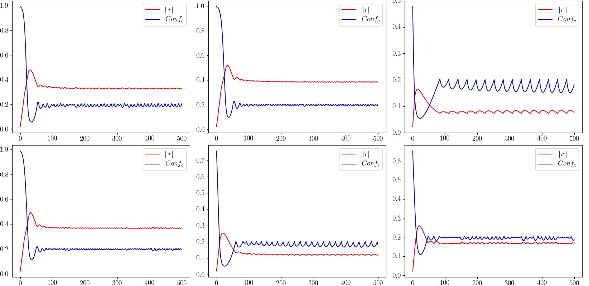

% Résistance aux attaques et corrections adversaires

> # Résumé
>
>  Ce travail est motivé par l'observation de deux phénomènes intéressants dans le fonctionnement d'un algorithme d'attaque adversaire par descente de gradient. Premièrement, on observe une corrélation entre la difficulté à effectuer cette attaque (quantifiée par le concept de résistance) et la justesse de la prédiction du réseau. On en déduit alors une nouvelle expression de l'assurance d'un réseau classificateur. Deuxièmement, l'attaque adversaire proposée, lorsqu'elle est effectuée à partir d'une image incorrectement classifiée, produit presque toujours une image dont la catégorie est celle de l'image initiale. 
>
> L'exploitation combinée de ces deux phénomènes conduit naturellement à une méthode pour augmenter la précision d'un réseau classificateur quelconque. Le manque de finesse de la résistance nous pousse à introduire un réseau discriminateur, qui cherche à prédire si le classificateur se trompe ou non, pour ensuite corriger cette erreur par correction adversaire.

# 1. Les attaques adversaires

## 1.1 Les exemples adversaires

Les réseaux de neurones sont notoirement vulnérables aux *exemples adversaires* [1]\ : il s'agit d'entrées imperceptiblement perturbées pour induire en erreur un réseau classificateur.

Plus concrètement, en considérant $Pred$ la fonction qui à une image associe la catégorie prédite par réseau ; et en considérant une image $img$ de $[0, 1]^n$ (c'est à dire à $n$ pixels N&B ou $n/3$ pixels RGB), on cherche une perturbation $r \in [0, 1]^n$, de norme minimale, telle que\ :

1. $img + r \in [0, 1]^n$
2. $Pred(img+r) \neq Pred(img)$

Dans toute la suite, on utilisera la norme euclidienne. D'autres normes sont évidemment possibles, mais sans amélioration sensible des résultats.

## 1.2 Les attaques adversaires

On s'intéresse à un algorithme qui détermine un exemple adversaire à partir d'une image donnée. On dit qu'un tel algorithme réalise une *attaque adversaire*.

Une méthode d'attaque possible est la suivante. Introduisons $Conf_c$ la fonction qui à une image  associe la probabilité (selon le réseau) que l'image appartienne à la  catégorie $c$ ; et soit une image $img$, prédite de catégorie $c$ par le réseau. On cherche alors à minimiser par descente de gradient la fonction $Loss_1$ suivante\ :
$$
Loss_1 =
\begin{cases}
  \Vert r \Vert                 & \text{ si } Conf_c(img+r) \leq 0.2 \\
  Conf_c(img+r) + \Vert r \Vert & \text{ sinon.}
\end{cases}
$$

Cette première fonction est expérimentalement peu satisfaisante car l'attaque échoue souvent\ : la perturbation reste "bloquée" en 0, et n'évolue pas. On pourrait corriger ce problème en initialisant la perturbation à une valeur aléatoire, mais cela enlèverait toute possibilité d'étudier la direction privilégiée par la descente de gradient. Pour pallier ce problème, on oblige alors la perturbation à grossir en ajoutant un troisième cas de figure quand $Conf_c(img+r) > 0.9$, c'est à dire quand la perturbation n'est pas du tout satisfaisante\ :
$$
Loss_2 =
\begin{cases}
  \Vert r \Vert                 & \text{ si } Conf_c(img+r) \leq 0.2 \\
  Conf_c(img+r) + \Vert r \Vert & \text{ si } Conf_c(img+r) \leq 0.9 \\
  Conf_c(img+r) - \Vert r \Vert & \text{ sinon.}
\end{cases}
$$

Cette deuxième fonction produit presque toujours un exemple adversaire pour un nombre d'étapes de descente de gradient suffisamment élevé (généralement 500 étapes suffisent), et c'est celle-ci qui sera utilisée par la suite.

La Figure 1 montre le résultat d'une attaque adversaire\ : à gauche l'image originale, au milieu la perturbation et à droite l'image adversaire.

On appellera $Pert_N$ la fonction qui à une image associe la perturbation obtenue après $N$ étapes de descente de gradient (avec un taux d'apprentissage $\eta = 10^{-3}$).

## 1.3 Réseaux classificateurs et bases de données utilisées

On réalisera toute cette étude sur deux réseaux de type `AlexNet` (CNN avec Dropout) [2], appliqués respectivement aux problèmes de la classification des images de `MNIST` [3] et de `FashionMNIST` [4].

Les bases de données `MNIST` et `FashionMNIST` sont divisées de la manière suivante\ :

- 50000 images d'entraînement (`train`)
- 10000 images de test (`test`)
- 10000 images de validation (`val`)

Les réseaux sont entraînés sur les images de $\texttt{train}$, et on utilisera systématiquement sur les images de `test` par la suite, afin de travailler sur des images que le réseau n'a jamais vues. Les images de $\texttt{val}$ serviront à évaluer la généralisation des résultats obtenus.

Sur les 10000 images de `test` de `MNIST`, toutes sauf 62 sont classifiées correctement par le réseau, et pour `FashionMNIST`, toutes sauf 917.

# 2. Résistance à une attaque

## 2.1 Images "faciles" et "difficiles" à attaquer

On réalise des attaques adversaires sur les images de `test`, en effectuant 500 étapes de descente du gradient de $Loss_2$, avec un taux d'apprentissage $\eta = 10^{-3}$, et on s'intéresse aux valeurs prises par $\Vert r \Vert$ et $Conf_c$ au cours de l'attaque.

La Figure 2 a été obtenue en attaquant deux images différentes de `test` de `MNIST`.

Qualitativement, la norme de la perturbation augmente jusqu'à ce que $Conf_c$ passe en dessous de 0.9, à partir de quoi la norme diminue tout en gardant une valeur de $Conf_c$ stabilisée autour de 0.2.

L'image de gauche peut être qualifiée de "difficile à attaquer"\ : il a été nécessaire d'augmenter très fortement la norme de la perturbation pour réussir à casser la prédiction du réseau, ce qui ne se produit qu'après un grand nombre d'étapes, et la norme finale de la perturbation est élevée.

L'image de droite peut au contraire être qualifiée de "facile à attaquer"\ : bien moins d'étapes ont été nécessaires pour casser la prédiction du réseau, la norme finale est très basse, et le pic de très faible amplitude.

On voit nettement ici l'influence de la valeur du seuil à 0.2 dans la fonction $Loss$. Dès que $Conf_c$ est en dessous de 0.2, l'algorithme a pour seul objectif de réduire la norme de la perturbation, et fatalement $Conf_c$ repasse au dessus de 0.2. Il s'agit alors de réduire à la fois $\Vert r \Vert$ et $Conf_c$, jusqu'à ce que $Conf_c$ repasse en dessous de 0.2, etc.

D'autres exemples d'attaques d'images "faciles" ou "difficiles" à attaquer sont présentés dans l'Annexe B.

Résumons les principales différences qualitatives entre ces deux types d'images\ :

|                     | Images "faciles" | Images "difficiles" |
| ------------------- | :--------------: | :-----------------: |
| Pic                 | Absent ou faible |        Haut         |
| Étapes nécessaires  |  moins de $50$   |    plus de $200$    |
| Norme de $r$ finale |      Faible      |       élevée        |

Pour quantifier plus précisément cette difficulté à attaquer une image, introduisons le concept de *résistance*.

## 2.2 Quantification de la résistance à une attaque

Pour chaque image, on essaie de quantifier la résistance, du réseau à une attaque adversaire. Plusieurs définitions sont possibles, par exemple la norme de la perturbation minimale mettant en échec le réseau\ :
$$
Res_\infty(img) = min \{\Vert r \Vert \; ; \; Pred(img+r) \neq Pred(img)\}
$$

Cette expression de la résistance n'est que d'un faible intérêt en pratique, car incalculable. On utilisera donc plutôt les trois définitions suivantes\ :

$Res_N$ la norme finale obtenue après un certain nombre d'étapes dans l'attaque adversaire\ :
$$
Res_N(img) = \Vert Pert_N(img) \Vert
$$

$Res_{max}$ la hauteur du pic de la norme de la perturbation\ :
$$
Res_{max}(img) = max\big\{\Vert Pert_N(img) \Vert \; ; \; N \in \mathbb{N}\big\}
$$

$Res_{min}$ le nombre d'étapes qu'il a fallu pour abaisser $Conf_c$ à $0.2$\ :
$$
Res_{min}(img) = min\big\{N \in \mathbb{N} \; ; \; Conf_c(Pert_N(img)) < 0.2\big\}
$$

## 2.3 Une corrélation avec la justesse de la prédiction

Les images attaquées dans l'Annexe B n'ont pas été choisies au hasard\ : les premières sont toutes classifiées correctement par le réseau, et les suivantes correspondent à des erreurs de classification.

Ces résultats se généralisent\ : étudions la répartition des valeurs de la résistance sur des images correctement classifiées (notées **V**), et incorrectement classifiées (notées **F**) de `test`.

Sur `MNIST`, avec 250 images dans **V** et les 62 erreurs dans **F**\ :

| `MNIST` |   $Res_N$   | $Res_{max}$ | $Res_{min}$ |
| ---------------- | :---------: | :---------: | :---------: |
| 90% de **V** | $\geq$ 0.90 | $\geq$ 1.89 |  $\geq$ 83  |
| 90% de **F** |  $<$ 0.75   |  $<$ 1.09   |   $<$ 58    |

Et sur `FashionMNIST`, avec 250 images dans **V** et dans **F**\ :

| `FashionMNIST` |   $Res_N$   | $Res_{max}$ | $Res_{min}$ |
| -------------- | :---------: | :---------: | :---------: |
| 80% de **V**   | $\geq$ 0.29 | $\geq$ 0.56 |  $\geq$ 25  |
| 80% de **F**   |  $<$ 0.31   |  $<$ 0.55   |   $<$ 25    |

Selon que les images sont correctement classifiées ou non, la répartition des résistances est très inégale\ : on trouve des valeurs des résistances qui discriminent de part et d'autre respectivement 90% des images **V** et **F** dans le cas de `MNIST`, et 80% pour `FashionMNIST`.

Une corrélation se dessine donc nettement entre la résistance et la justesse de la prédiction du réseau.

## 2.4. Une méthode de détection des exemples adversaires

Toute l'étude précédente a été réalisé dans l'hypothèse de l'absence d'exemples adversaires dans les bases de données étudiées. Une résistance faible était alors presque toujours associée à une erreur de classification.

Dans un milieu "hostile", où la présence d'exemples adversaires est envisageable, un tel raccourci n'est plus valable. Essayons cependant d'utiliser ce même concept de résistance comme méthode de détection d'exemples adversaires.

### 2.4.1 Génération d'exemples adversaires

La partie 1 présente une méthode efficace de génération d'exemple adversaire. On souhaite cependant se prémunir contre le plus grand nombre d'attaques possibles, et c'est pourquoi on confiera la génération d'exemples adversaires à la bibliothèque $\texttt{CleverHans}$ [5].

*expliquer ici rapidement les attaques utilisées*

### 2.4.2 Identification des exemples adversaires

*étudier de la répartition des résistances sur les images __V__ (vraies images) et __A__ (exemples adversaires)*

On ne peut plus alors conclure sur le contenu de l'image\ : une double attaque adversaire pourrait consister à faire croire que la catégorie prédite est fausse... 

# 3. Une nouvelle expression de l'assurance d'un réseau

L'assurance du réseau sur sa prédiction, dénotée par la fonction $Conf_c$ où $c$ est la catégorie prédite n'est souvent pas une grandeur pertinente\ : elle est la plupart du temps très proche de $0$ ou de $1$ (ce qui est dû à l'algorithme de descente de gradient lors de l'apprentissage), et les exemples adversaires montrent que cette valeur n'est pas toujours fiable\ : le réseau peut facilement se tromper tout en étant certain à 99% de sa prédiction.

Une bonne fonction d'assurance devrait permettre de savoir si le réseau est véritablement sur de sa prédiction, ou bien s'il se trompe peut être, ou encore si il est face à un exemple adversaire.

De plus, on a vu qu'une résistance haute correspond le plus souvent à une prédiction fiable, et qu'une résistance faible correspond ou bien à une erreur de classification, ou bien à une attaque du réseau. En utilisant cela, on peut proposer une autre expression de cette assurance, dont la valeur aura un sens concret\ :
$$
Conf2_c(img) = \frac{Res}{1 + Res}
$$

*À compléter*

# 4. Les corrections adversaires

Le deuxième phénomène observé est le suivant\ : l'attaque adversaire décrite partie 1, effectuée sur une image incorrectement classifiée par le réseau, produit presque toujours une image dont la catégorie sera celle de l'image initiale. On qualifiera ce phénomène de correction adversaire.

Ainsi, avec les réseaux précédents\ : sur les 62 erreurs commises sur la base test de `MNIST`, 53 sont rattrapées par les corrections adversaires ; et sur les 876 commises sur `FashionMNIST`, 613 sont rattrapées, soit respectivement 85% et 70%.

On a donc un premier résultat\ : à partir d'un réseau d'erreur *Top 1* donnée, on peut en déduire un système d'erreur *Top 2* sensiblement moindre\ : dans les exemples précédents, on passe d'erreurs *Top 1* de 0.53% et 8.7% à des erreurs *Top 2* de respectivement 0.09% et 2.6%.

Cette stratégie peut être intéressante dans une tâche de type \texttt{ImageNet}, où l'on s'intéresse à l'erreur *Top 5* commise par le classificateur. Utilisons l'algorithme suivant\ : sur les 5 meilleures prédictions du réseau, on ne conserve que les 3 meilleures, et on détermine deux autres catégories en réalisant des corrections adversaires a partir des deux premières.

*Faute de moyens techniques, cet algorithme n'a pu être expérimenté (taille gigantesque de la base de données), mais son efficacité à améliorer les résultats du classificateur est conjecturée.*

# 5. Une méthode pour réduire l'erreur du réseau

## 5.1 Une première méthode...

Exploitons les deux phénomènes précédents pour tenter de réduire l'erreur commise par le réseau\ : On détermine la résistance de chaque image du réseau. Si la résistance est supérieure à un certain critère, on considérera que la prédiction du réseau est correcte ; sinon on choisit comme prédiction le résultat de la contre-attaque adversaire.

Sur un lot de 275 images de `test` de `FashionMNIST` (250 justes, 25 erreurs, proportion représentative de la base totale), avec respectivement $Res_{N=500}$, $Res_{min}$ et $Res_{max}$, on obtient le nombre d'erreurs commises en fonction du critère choisi, Figure 3.

Avec des critères à 0, on retrouve naturellement 25 erreurs, puisque l'on n'a rien modifié aux prédictions du réseau.

En revanche, avec des critère respectivement à 0.4, 0.685 et 45, le réseau ne commet plus que 11 erreurs.

## 5.2 ...peu efficace à grande échelle.

En appliquant les méthodes précédentes à l'ensemble de $10000$ images de `test` de `FashionMNIST`, on ne réussit qu'à faire passer le nombre d'erreurs de $X$ à $X$ dans le meilleur des cas. Le choix arbitraire d'un critère fixé n'est donc pas une méthode efficace ici.

Ceci s'explique simplement\ : le nombre d'erreurs corrigées est trop faible devant le nombre de faux-positifs (images bien classées, mais considérées comme des erreurs par le critère), annulant tout le gain obtenu.

## 5.3 Réseau discriminateur

Le choix arbitraire d'un critère et la représentation de la résistance par une seule valeur ne sont donc pas des méthodes efficaces pour réduire l'erreur du réseau. Essayons alors d'affiner la distinction entre les images correctement ou incorrectement prédites. Pour cela, on cherche à entraîner un réseau de neurones, dit *discriminateur*, à faire la distinction entre les images qui seront bien classifiées et celles qui seront mal classifiées.

### 5.3.1 Quelles données en entrée du réseau ?

*À compléter*

### 5.3.2 Structure et entraînement du réseau

*À compléter*

### 5.3.3 Généralisation des résultats obtenus

Pour évaluer la généralisation de cette nouvelle méthode, on l'applique sur les images de $\texttt{val}$, sur lesquelles on n'a toujours pas travaillé, que ce soit pour l'entraînement du réseau ou la détermination du critère.

*À compléter*

# Bibliographie

[1] C. Szegedy, I. Goodfellow & al. CoRR, **Intriguing Properties of Neural Networks.** (Déc. 2013)

[2] A. Krizhevsky, I. Sutskever & G. Hinton. NIPS'12 Proceedings, **ImageNet Classification with Deep Convolutional Neural Networks .** Volume 1 (2012), Pages 1097-1105

[3] Y. Le Cun & C. Cortes. **The MNIST handwritten digit database.**

[4] H. Xiao, K. Rasul & R. Vollgraf. **Fashion-MNIST: a Novel Image Dataset for Benchmarking Machine Learning Algorithms.** *arXiv:1708.07747*

[5] N. Papernot, N. Carlini, I. Goodfellow & al. **CleverHans v2.0.0: an adversarial machine learning library.** *arXiv:1610.00768*

---

\newpage
# A. Structure des réseaux utilisées

\newpage
# Quelques attaques supplémentaires

En Figure 4, les valeurs prises par $\Vert r \Vert$ et $Conf_c$ au cours de l'attaque de 6 images "difficiles" à attaquer.

{width=95%}

En Figure 5, même chose avec 6 images "faciles" à attaquer.

{width=95%}
