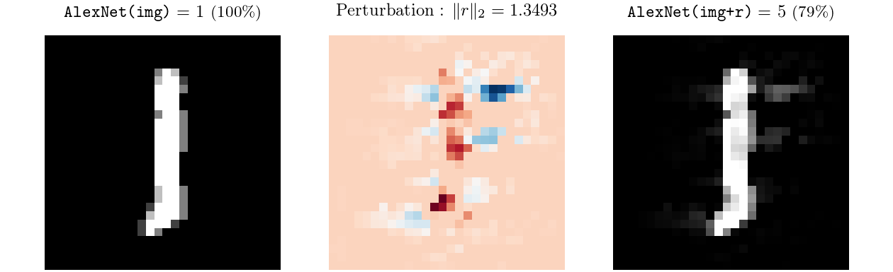
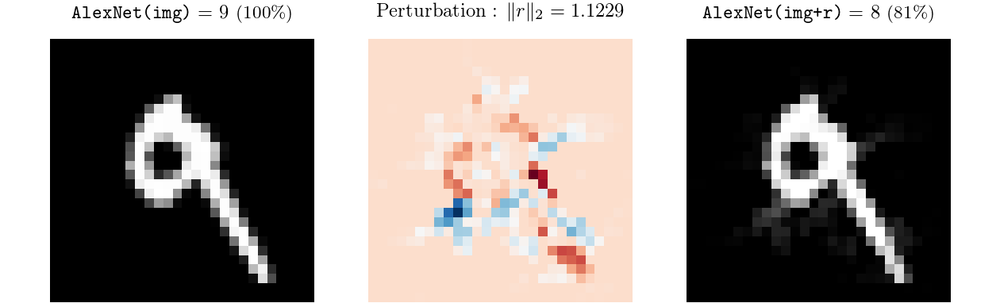
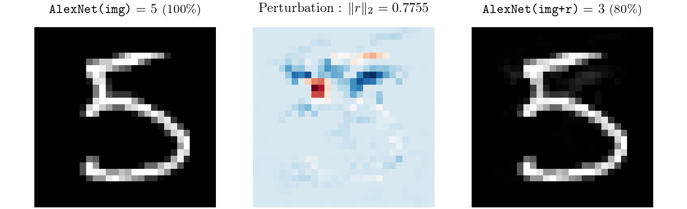
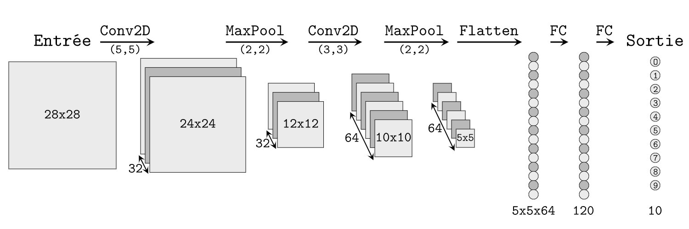

# Résistance aux attaques et corrections adversaires

> # Résumé
>
>  Ce travail est motivé par l'observation de deux phénomènes intéressants dans le fonctionnement d'un algorithme particulier d'attaque adversaire. Premièrement, on identifie une corrélation entre la difficulté à effectuer cette attaque et la justesse de la prédiction du réseau. Deuxièmement, cette attaque adversaire, lorsqu'elle est effectuée à partir d'une image incorrectement classifiée, produit presque toujours une image dont la catégorie est celle de l'image initiale. 
>
> Le premier phénomène nous conduit alors à une nouvelle expression plus qualitative de l'assurance d'un réseau classificateur ; et l'exploitation combinée des deux phénomènes nous amène à rechercher une méthode pour augmenter la précision et la robustesse d'un réseau classificateur donné.

## 1. Les attaques adversaires

### 1.1 Les exemples adversaires

Déterminer chacun des degrés des sommets a un coût proportionnel aux nombre d'arêtes, donc $0(n)$. Insérer

Les réseaux de neurones sont hautement vulnérables aux *exemples adversaires* [1]. Un exemple adversaire est une entrée légèrement perturbée dans le but d'induire en erreur un réseau classificateur. Le plus souvent, ces perturbations sont imperceptibles pour l’œil humain.

Plus concrètement, en considérant \Pred la fonction qui à une image associe la catégorie prédite par réseau ; et en considérant une image $img \in [0, 1]^n$ (c'est à dire à $n$ pixels N&B ou $\frac{n}{3}$ pixels RGB), on cherche une perturbation $r \in [0, 1]^n$, de norme (le plus souvent euclidienne) minimale, telle que :

(i)  $img + r \in [0, 1]^n$
(ii) $\Pred(img+r) \neq \Pred(img)$

*Remarque* : Dans toute la suite, on utilisera la norme euclidienne, notée \norme{\cdot}.

### 1.2 Les attaques adversaires

Une *attaque adversaire* est un algorithme qui détermine un exemple adversaire à partir d'une image donnée.

Une méthode d'attaque adversaire possible est la suivante. Soit une image $img$, prédite de catégorie $c$ par le réseau. Introduisons alors \Confc la fonction qui quantifie la probabilité (selon le réseau) que l'image soit de catégorie $c$. On cherche alors à minimiser par descente de gradient, sur $r$ initialisé à $0^n$, la fonction :
$$
\mathrm{Loss_1}(r) =
\begin{cases}
  \norme{r}                 & \text{ si } \Confc(img+r) \leq 0.2 \\
  \Confc(img+r) + \norme{r} & \text{ sinon.}
\end{cases}
$$

Cette attaque échoue presque toujours : la perturbation $r$ reste "bloquée" en 0 $0$. On pourrait corriger ce problème en initialisant la perturbation à une faible valeur aléatoire, mais cela enlèverait toute possibilité d'étudier la direction privilégiée par la descente de gradient. Pour pallier ce problème, on "incite" alors la perturbation à grossir en norme en ajoutant un troisième cas de figure quand $\Confc(img+r) > 0.9$ :
$$
\mathrm{Loss_2}(r) =
\begin{cases}
  \norme{r}                 & \text{ si } \Confc(img+r) \leq 0.2 \\
  \Confc(img+r) + \norme{r} & \text{ si } \Confc(img+r) \leq 0.9 \\
  \Confc(img+r) - \norme{r} & \text{ sinon.}
\end{cases}
$$

Même si elle échoue encore souvent, cette deuxième fonction se révélera suffisante pour la suite.

On appellera alors \PertN la fonction qui à une image associe la perturbation obtenue après $N$ étapes de descente de gradient de la fonction $\mathrm{Loss_2}$ avec $r$ initialisé à 0 (algorithme `Adam`, avec un taux d'apprentissage $\eta = 10^{-3}$).

En *Annexe A* sont présentés quelques résultats d'attaques adversaires sur les images de chiffres de `MNIST`.

### 1.3 Réseaux classificateurs et bases de données utilisées

On réalisera toute cette étude sur deux réseaux de type `AlexNet` (CNN avec Dropout) [2], appliqués respectivement aux problèmes de la classification des images de `MNIST` [3] et de `FashionMNIST` [4]. Ces réseaux et leur entraînement sont décrits plus précisément dans l'*Annexe B*.

On travaillera par la suite sur les sous-bases de `test` (constituées de 10000 images) de ces bases de données, afin de travailler sur des images qui n'ont pas été utilisées lors de l'apprentissage. Les deux réseaux ont alors les performances suivantes :

- 62 erreurs sur les 10000 images de `test` de `MNIST`,
- 876 erreurs sur les 10000 images de `test` de `FashionMNIST`.

## 2. Résistance à une attaque

### 2.1 Images "faciles" et "difficiles" à attaquer

On s'intéresse aux valeurs prises par \norme{r} et \Confc au cours de l'attaque adversaire décrite en 1.2. La Figure 1 a été obtenue en attaquant deux images différentes de `MNIST`.

{width=80%}

L'image de gauche peut être qualifiée de "difficile à attaquer" : un grand nombre d'étapes ont été nécessaires pour casser la prédiction du réseau ; il a été nécessaire pour cela d'atteindre une norme très élevée ; et la norme finale de la perturbation est importante.

L'image de droite peut au contraire être qualifiée de "facile à attaquer" : le nombre d'étapes nécessaires pour casser la prédiction du réseau est petit ; le pic de très faible amplitude ; et la norme finale basse.

Les images de l'*Annexe C* se classifient aisément de la sorte entre "faciles" et "difficiles" à attaquer. 

Résumons les principales différences lors du déroulement de l'attaque entre les deux types d'images :

|                     | Images "faciles" | Images "difficiles" |
| ------------------- | :--------------: | :-----------------: |
| Étapes nécessaires  |   moins de 50    |     plus de 200     |
| Pic                 | absent ou faible |        haut         |
| Norme de $r$ finale |      faible      |       élevée        |

Pour quantifier plus précisément cette difficulté à attaquer une image, introduisons le concept de *résistance*.

### 2.2 Quantification de la résistance à une attaque

On essaie de quantifier la résistance de chaque image à notre attaque adversaire. Motivés par les observations de la partie précédente, on utilisera les trois expressions suivantes : \ResN la norme de la perturbation obtenue après $N$ étapes ; \Resmax la plus haute norme de la perturbation au cours de l'attaque ; et \Resmin le nombre d'étapes qu'il a fallu pour abaisser \Confc à 0.2. On pose donc :

- $\ResN(img) = \norme{\PertN(img)}$

- $\Resmax(img) = \max \big\{\norme{\PertN(img)} \Vert \text{ tel que } N \in \mathbb{N}\big\}$

- $\Resmin(img) = \min \big\{N \in \mathbb{N} \text{ tel que } \Confc\big(\PertN(img)\big) < 0.2\big\}$

Dans les cas où l'attaque échoue, on prendra systématiquement $Res = + \infty$.

*Remarque* : Une définition immédiate de la résistance serait la norme de la perturbation minimale mettant en échec le réseau. Cette expression n'est cependant que d'un faible intérêt pratique, car incalculable.

### 2.3 Une corrélation avec la justesse de la prédiction

Les images attaquées dans l'*Annexe C* n'ont pas été choisies au hasard : les premières correspondent correspondent à des erreurs de classification, et les suivantes à des classifications justes. Étudions la généralisation de ces résultats, en observant la répartition des valeurs de la résistance sur des images correctement classifiées (notées `V`), et incorrectement classifiées (notées `F`).

| `MNIST`    | \ResN  | \Resmax | \Resmin | \S | `FashionMNIST` | \ResN  | \Resmax | \Resmin |
| ---------- | :----: | :-----: | :-----: | -- | -------------- | :----: | :-----: | :-----: |
| 90% de `V` | > 0.97 |  > 2.8  |  > 109  | \S | 80% de `V`     | > 0.28 | > 0.544 |  > 26   |
| 90% de `F` | < 0.57 |  < 1.3  |  < 58   | \S | 80% de `F`     | < 0.29 | < 0.543 |  < 25   |

*À gauche, `MNIST` avec 500 images dans `V` et les 62 erreurs dans `F` ; à droite `FashionMNIST` avec 500 images dans `V` et dans `F`.*

Selon que les images sont correctement classifiées ou non, la répartition des résistances est très inégale : on trouve des valeurs des résistances qui discriminent de part et d'autre respectivement 90% (voire 95%) des images `V` et `F` dans le cas de `MNIST`, et tout juste 80% pour `FashionMNIST`.

*Remarque* : L'attaque n'échoue pour aucune des images incorrectement classifiées de `MNIST`, et sur seulement 2 des 500 incorrectement classifiées de `FashionMNIST` étudiées. Par la suite, le succès de l'attaque ne sera utile que sur les images incorrectement classifiées, ce qui valide le choix de la fonction $Loss_2$ en partie 1.

Une nette corrélation se dessine donc nettement entre la résistance et la justesse de la prédiction du réseau : une résistance élevée est souvent associée à une prédiction juste, et une résistance faible à une erreur de classification.

### 2.4. Une méthode de détection des exemples adversaires

On observe des résultats similaires dans le cas des attaques adversaires : les exemples adversaires sont en général plus "facile" à attaquer que les "vraies" images.

La partie 1 présente une méthode efficace de génération d'exemple adversaire. On souhaite cependant se prémunir contre le plus grand nombre d'attaques possibles, et c'est pourquoi on confiera la génération d'exemples adversaires à la bibliothèque `CleverHans` [5].

On utilisera les trois attaques suivantes :

1. Première attaque
2. Deuxième attaque
3. Troisième attaque

Étudions la répartition des valeurs de la résistance sur 500 images non altérées (notées `V`), et sur trois lots de 100 exemples adversaires (notées `A1`, `A2` et `A3`), correspondant aux trois méthodes ci-dessus.

| `MNIST`     | \ResN  | \Resmax | \Resmin | \S | `FashionMNIST` | \ResN  | \Resmax | \Resmin |
| ----------- | :----: | :-----: | :-----: | -- | -------------- | :----: | :-----: | :-----: |
|   % de `V`  | >      |  >      |  >      | \S |   % de `V`     | >      |  >      |  >      |
|   % de `A1` | <      |  <      |  <      | \S |   % de `A1`    | <      |  <      |  <      |
|   % de `A2` | <      |  <      |  <      | \S |   % de `A2`    | <      |  <      |  <      |
|   % de `A3` | <      |  <      |  <      | \S |   % de `A3`    | <      |  <      |  <      |

*Remarque* : Il est bien sûr envisageable que des exemples adversaires puissent être conçus pour tromper cette détection, mais bla bla bla bla bla bla bla bla bla bla bla bla bla bla bla bla bla bla bla bla bla bla bla bla bla bla bla bla bla bla bla bla bla bla bla bla bla bla.

<!-- ............................. -->
<!-- ............................. -->
<!-- SUPPRIMER TOUTE LA PARTIE 3 ? -->
<!-- ............................. -->
<!-- ............................. -->

## 3. Une nouvelle expression de l'assurance d'un réseau

L'assurance (*confidence*) du réseau sur sa prédiction, dénotée par la fonction \Confc où $c$ est la catégorie prédite n'est souvent pas une grandeur pertinente : elle offre peu de nuance (systématiquement quasi-égale à 0 ou 1), et les exemples adversaires montrent qu'elle n'est pas toujours fiable : le réseau peut facilement se tromper tout en étant "certain" à 100% de sa prédiction.

Proposons alors un autre candidat : on a vu qu'une résistance élevée correspond le plus souvent à une prédiction juste, et qu'une résistance faible correspond ou bien à une erreur de classification, ou bien à une attaque du réseau. On peut donc proposer :
$$
\Confbis(img) = \cfrac{\Res / K}{1 + \Res / K}
$$

où $K$ est une constante arbitraire, valeur médiane de la résistance sur un échantillon suffisamment grand, constitué à parts égales d'images correctement classifiées et d'images incorrectement classifiées. De la sorte, une valeur de \Confbis au dessus de 0.5 correspondra le plus souvent à une prédiction correcte, et une valeur en dessous de 0.5 indiquera une probable erreur de prédiction. 

## 4. Les corrections adversaires

Le deuxième phénomène observé est le suivant : l'attaque adversaire décrite partie 1, effectuée sur une image incorrectement classifiée par le réseau, produit presque toujours une image dont la catégorie est celle de l'image initiale. On qualifiera ce phénomène de _**correction adversaire**_.

Ainsi, avec les réseaux précédents : sur les 62 erreurs commises sur la base test de `MNIST`, 53 sont rattrapées par les corrections adversaires ; et sur les 876 commises sur `FashionMNIST`, 613 sont rattrapées, soit respectivement 85% et 70%.

On a donc un premier résultat : à partir d'un réseau d'erreur *Top-1* donnée, on peut en déduire un système d'erreur *Top-2* sensiblement moindre : dans les exemples précédents, on passe d'erreurs *Top-1* de 0.53% et 8.7% à des erreurs *Top-2* de respectivement 0.09% et 2.6%.

Cette stratégie peut être intéressante dans une tâche de type `ImageNet`, où l'on s'intéresse à l'erreur *Top-5* commise par le classificateur. Utilisons l'algorithme suivant : sur les 5 meilleures prédictions du réseau, on ne conserve que les 3 meilleures, et on détermine deux autres catégories en réalisant des corrections adversaires a partir des deux premières.

*Faute de puissance calculatoire, cet algorithme n'a pu être expérimenté (à cause de la taille gigantesque de la base de données `ImageNet`), mais son efficacité à améliorer les résultats d'un classificateur est conjecturée*

## 5. Une méthode pour réduire l'erreur du réseau

Dans toute cette partie, on travaillera dans l'hypothèse de l'absence d'exemples adversaires dans les bases de données étudiées. Une résistance faible est alors presque toujours associée à une erreur de classification. On cherche alors à identifier le plus finement possible les erreurs de classification du réseau, pour les corriger ensuite avec la méthode de la correction adversaire.

### 5.1 Méthode directe

La méthode "naïve" est la suivante : on détermine la résistance de chaque image du réseau ; si elle est supérieure à un certain seuil alors on considérera que la prédiction du réseau est correcte, sinon on choisit comme prédiction le résultat de la correction adversaire.

Sur un lot de 275 images de `test` de `FashionMNIST` (250 justes, 25 erreurs, proportion représentative de la base totale), avec respectivement $Res_{N=500}$, \Resmin et \Resmax, on obtient le nombre d'erreurs commises en fonction du seuil choisi, Figure 2.

{width=80%}

Avec des seuils à 0, on retrouve naturellement 25 erreurs, puisque l'on n'a rien modifié aux prédictions du réseau. En revanche, avec des seuil respectivement à 0.4, 0.685 et 45, le réseau ne commet plus que 11 erreurs.

La généralisation de cette méthode est cependant décevante : quand la taille du lot augmente, on fait à peine décroître le nombre d'erreurs dans le meilleur des cas. Ceci s'explique simplement : le nombre d'erreurs corrigées est trop faible devant le nombre de faux-positifs (images bien classées, mais considérées comme des erreurs par le seuil), annulant tout le gain obtenu.

### 5.2 Réseau discriminateur

Le choix arbitraire d'un seuil et la représentation de la résistance par une seule valeur ne sont donc pas des méthodes suffisantes pour réduire l'erreur du réseau. Essayons alors d'affiner la distinction entre les images correctement ou incorrectement prédites. Pour cela, on cherche à entraîner un réseau de neurones, appelé *discriminateur*, à faire la distinction entre les images qui seront bien classifiées et celles qui seront mal classifiées.

Les données en entrée du discriminateur seront les valeurs de \norme{r} ou de \Confc au cours de l'attaque des images. On construit ces bases de données à partir des images d'entraînement des réseaux classificateurs uniquement, de sorte à observer la généralisation des résultats aux images de `test`. On appellera `norms` et `confs` ces bases de données.

On utilise un réseau de neurones très simple : 50 neurones sur la couche d'entrée, 30 neurones sur la couche intermédiaire, 2 neurones en couche de sortie. On utilisera la fonction de transfert ReLU pour les deux premières couches, et une fonction Softmax en sortie. On entraîne ce réseau en 40 étapes (*epochs*), avec des paquets de taille 32 (*mini-batches*). On utilise l'entropie croisée comme fonction d'erreur, et l'algorithme `Adam` pour réaliser la descente de gradient, avec un taux d'apprentissage $\eta = 5 \cdot 10^{-4}$.

Observons les résultats obtenus par le réseau discriminateur sur les 10000 images de `test`, en fonction du problème étudié et de la base utilisée pour le discriminateur (`norms` ou `confs`) :

| Erreurs                  | Faux positifs | Faux négatifs |    Total    |
| ------------------------ | :-----------: | :-----------: | :---------: |
| `MNIST` (`norms`)        |     412       |       4       |  416 (4.2%) |
| `MNIST` (`confs`)        |     360       |       4       |  364 (3.6%) |
| `FashionMNIST` (`norms`) |     2424      |      109      |  2533 (25%) |
| `FashionMNIST` (`confs`) |     2071      |      130      |  2201 (22%) |

On appelle *faux positifs* les images correctement classifiées, mais prédites comme des erreurs par le discriminateur ; et *faux négatifs* les images incorrectement classifiées mais prédites comme des images correctement classifiées par le discriminateur.

Ces résultats sont encore décevants : on retrouve une séparation d'une finesse du même ordre de celle partie 2.3, à la nuance près que cette séparation a cette fois-ci été faite sans connaître au préalable les images de `test`. Pour que la correction ait un intérêt, il faut que la précision du réseau discriminateur soit plus fine que celle du réseau classificateur, ce qui n'est manifestement pas le cas ici : respectivement 364 contre 62 erreurs et 2201 contre 876 erreurs sur les 10000 images de `test` pour `MNIST` et `FashionMNIST`. On en déduit que les bases de données `norms` et `confs` ne contiennent pas assez d'informations pour réaliser finement cette discrimination entre images correctement classifiées, et incorrectement classifiées.

## Conclusion

\TODO{Compléter.}

## Bibliographie

[1] C. Szegedy, I. Goodfellow & al. CoRR, **Intriguing Properties of Neural Networks.** (Déc. 2013)

[2] A. Krizhevsky, I. Sutskever & G. Hinton. NIPS'12 Proceedings, **ImageNet Classification with Deep Convolutional Neural Networks .** Volume 1 (2012), Pages 1097-1105

[3] Y. Le Cun & C. Cortes. **The MNIST handwritten digit database.**

[4] H. Xiao, K. Rasul & R. Vollgraf. **Fashion-MNIST: a Novel Image Dataset for Benchmarking Machine Learning Algorithms.** *arXiv:1708.07747*

[5] N. Papernot, N. Carlini, I. Goodfellow & al. **CleverHans v2.0.0: an adversarial machine learning library.** *arXiv:1610.00768*

\newpage
## A. Résultats d'attaques adversaires

\newpage
## B. Structure et entraînement des réseaux classificateurs

Les deux réseaux ont la même architecture (structure), inspirée de celle du réseau `AlexNet` :

- `Entrée : 28` $\times$ `28`
- `Convolution : 32 couches, noyau 5` $\times$ `5`
- `ReLU`
- `MaxPool : noyau 2` $\times$ `2`
- `Convolution : 64 couches, noyau 3` $\times$ `3`
- `ReLU`
- `MaxPool : noyau 2` $\times$ `2`
- `Dropout`
- `Couche complète : 64` $\times$ `5` $\times$ `5` $\rightarrow$ `120`
- `ReLU`
- `Dropout`
- `Couche complète : 120` $\rightarrow$ `10`
- `Softmax`

\newpage
## C. Évolutions de \norme{r} et \Confc au cours d'attaques

{width=93%}

{width=93%}
