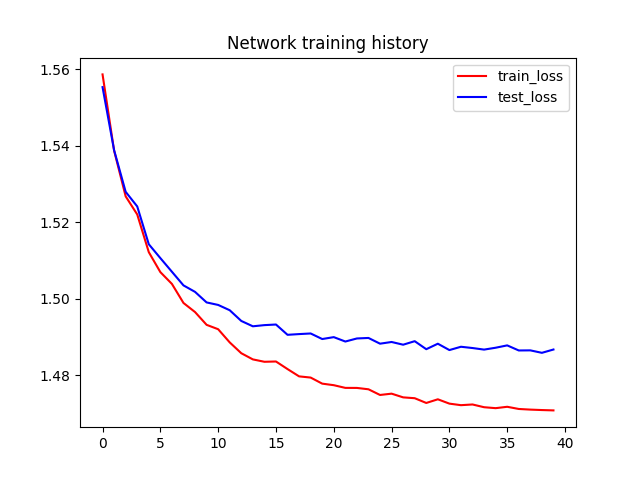
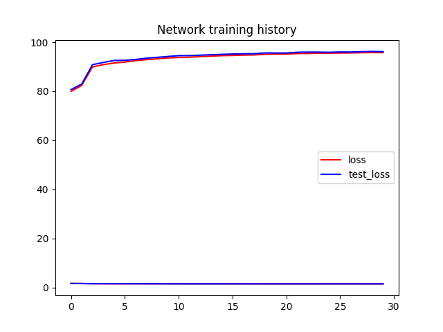
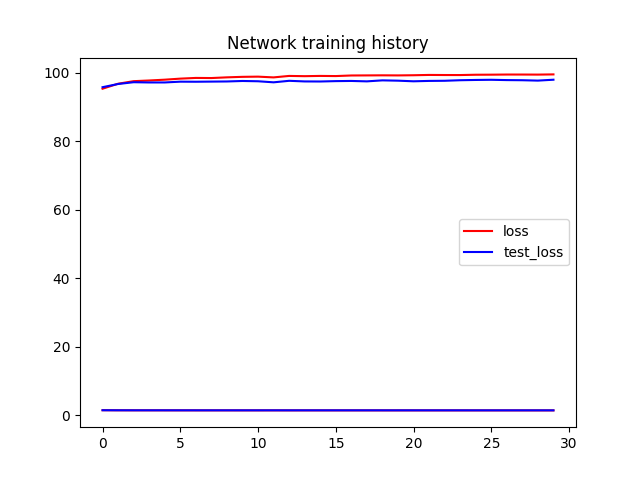
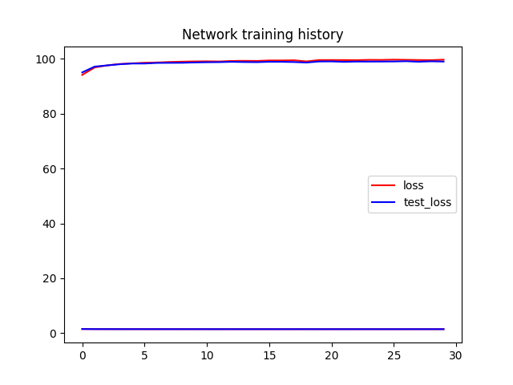
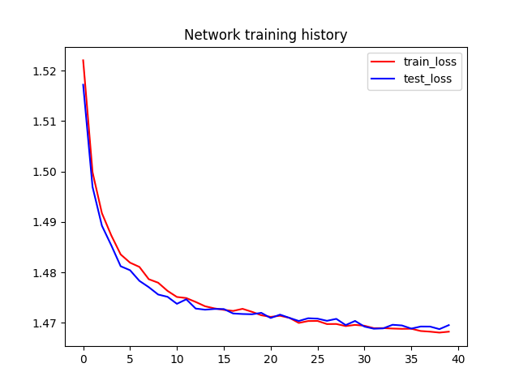
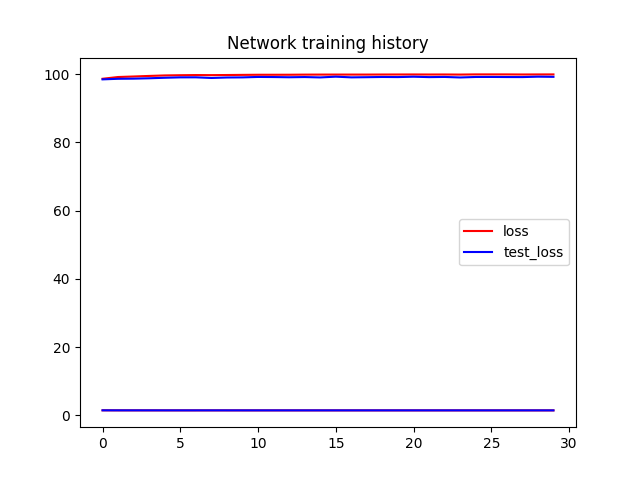

# History graphs

## MLP

**HP modifications:**

## MLP (Dropout)

**HP modifications:**

## MLP (BatchNorm)

**HP modifications:**

## CNN

**HP modifications:**

## CNN (Dropout)

**HP modifications:**

## CNN (BatchNorm)

**HP modifications:**
